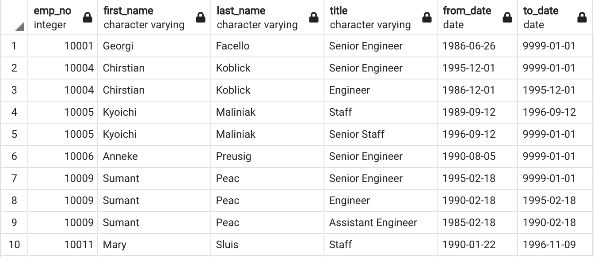
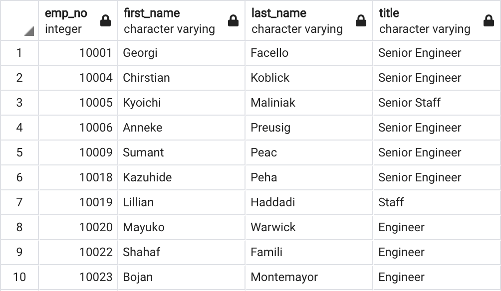
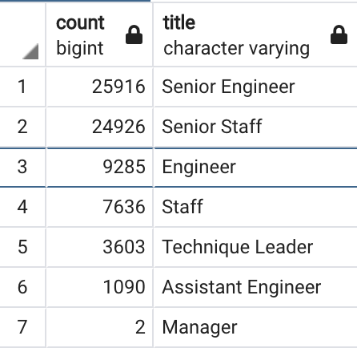
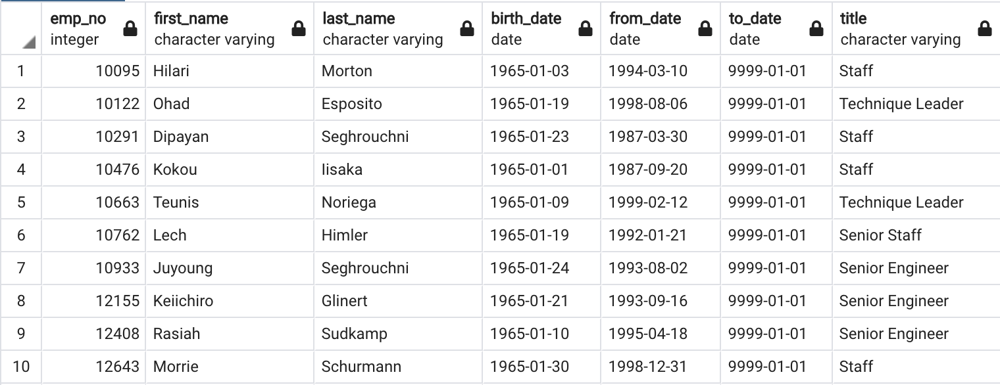
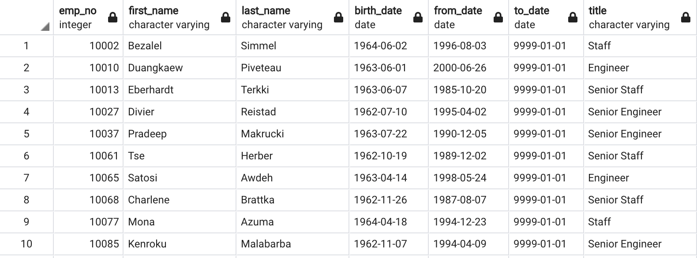
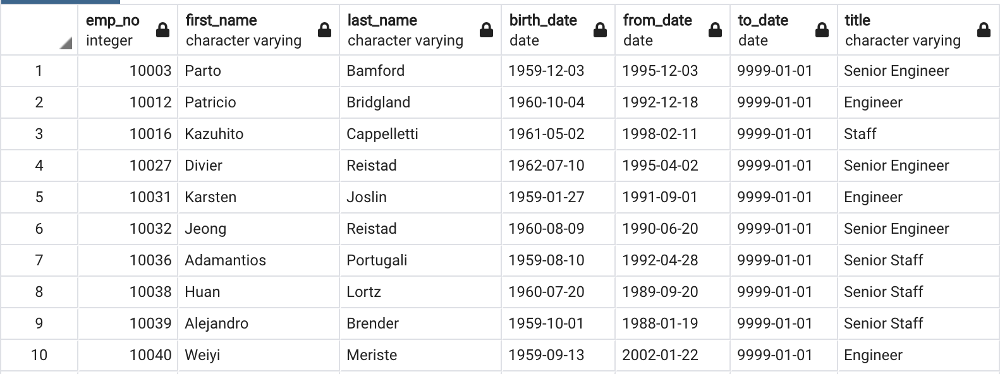

# Pewlett-Hackard-Analysis

## Resources
Database manager: pgAdmin 4 version 6.1

## Overview
The purpose of this project is to determine the number of employees with each job title retiring in the near future as well as the employees eligible to participate in a mentorship program. There are a lot of employees nearing retirement age at Pewlett Hackard and the company wants to plan appropriately.

#### Queries: [Employee_Database_Challenge.sql](Queries/Employee_Database_challenge.sql)

## Results

- The Senior Engineer and Senior Staff job titles will be losing the most employees to retirement, with 25,916 and 24,926 anticipated retirements, respectively. 
- In total, there are 72,458 expected retirements (based on current employees born from 1952-1955).
- There are only 1549 employees eligible for mentorship.
- Only 2 managers are expected to retire with the 'silver tsumani'

### Table of all employees born between 1/1/52-12/31/55 and their titles (first 10 rows)
#### Full CSV available here: [retirement_titles.csv](Data/retirement_titles.csv)

### Table of all employees born between 1/1/52 - 12/31/55 and their most recent title (first 10 rows)
#### Full CSV available here: [unique_titles.csv](Data/unique_titles.csv)

### Number of retirees with each job title about to retire
#### Full CSV available here: [retiring_titles.csv](Data/retiring_titles.csv)

### Table of all employees born between 1/1/1965-12/31/1965 (first 10 rows)
#### Full CSV available here: [mentorship_eligibility.csv](Data/mentorship_eligibility.csv)

## Summary

As mentioned above, there are an anticipated 72,458 retirements happening over about a four year time span, assuming people all retire at the age of 65. However, there are only 1549 employees eligible for mentorship based on the eligibility requirements. There are more than 46 times as many employees retiring as there are eligible for mentorship, indicating that there are not enough employees available for mentorship. One possible solution is to expand the criteria for mentorship eligibility to include more years of birth.

### Additional queries
If we expand the criteria for mentorship to include those born between 1/1/62-12/31/65 the number of employees eligible for the mentorship program jumps to 56,859 employees, vs only 1549 for those born in 1965.

### Table of all employees born between 1/1/62-12/31/65 (first 10 rows)
#### Full CSV available here: [expanded_mentorship_eligibilty.csv](Data/expanded_mentorship_eligibility.csv)

Alternatively, if we expand the criteria for mentorship to include those born betwen 1/1/59-12/31/62, the number of employees eligible for the mentorship program jumps to 74,062.

### Table of all employees born between 1/1/59-12/31/62 (first 10 rows)
#### Full CSV available here: [expanded_mentorship_eligibility_older.csv](Data/expanded_mentorship_eligibility_older.csv)

### Recommendations
Based on the above data, I recommend expanded the mentorship eligibility requirements so that there are enough employees to be mentored by the employees expected to retire. This will ensure the smoothest transition during the expected 'silver tsumani'.
